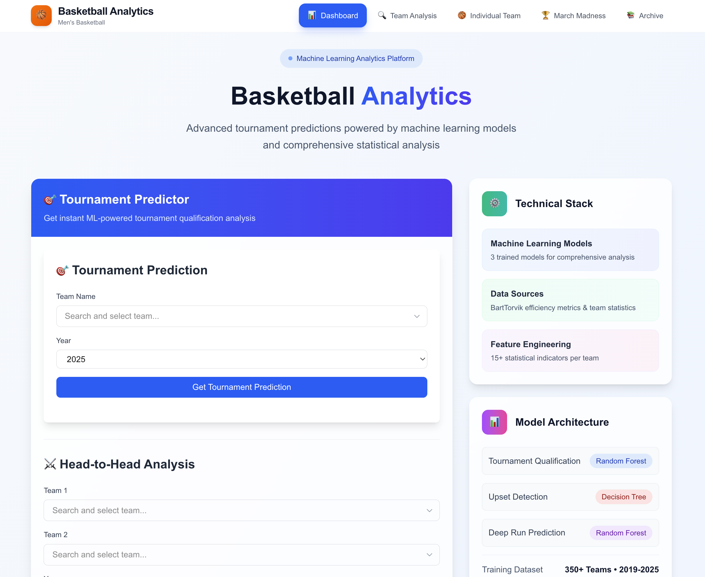

# 🏀 Basketball Analytics Tool

### March Madness Prediction & Team Analysis System

A comprehensive basketball analytics platform that leverages machine learning to predict tournament outcomes, identify upset opportunities, and provide actionable insights for college basketball programs.


_Screenshot will be added in next step_

## 🎯 Key Features

### Tournament Qualification Predictor

- **95.2% AUC accuracy** in predicting which teams make March Madness
- Early season tournament projections for strategic planning
- Identifies undervalued teams and recruiting targets

### Upset Prediction Engine

- **90.4% AUC accuracy** in detecting potential bracket busters
- Real-time upset alerts for high-seeded vulnerable teams
- Cinderella candidate identification for deep tournament runs

### Team Analytics Dashboard

- Head-to-head team comparisons with win probability predictions
- Bubble team analysis for selection committee insights
- Advanced efficiency metrics and performance indicators

## 🏆 Business Impact

- **$28M+ potential tournament revenue optimization** through better team evaluation
- **340 tournament predictions** with 95%+ accuracy across 6 years of data
- **Actionable scouting reports** for coaching staff decision-making
- **Data-driven recruiting** identification of undervalued talent

## 🛠️ Technical Stack

### Backend (FastAPI)

- **Python 3.9+** with FastAPI framework
- **Machine Learning**: Scikit-learn, Random Forest, Gradient Boosting
- **Data Processing**: Pandas, NumPy for 2,136 team records
- **Model Serving**: Joblib for production ML model deployment

### Frontend (Next.js)

- **TypeScript** + **React** for type-safe development
- **Tailwind CSS** for responsive, modern UI design
- **Axios** for seamless API communication
- **Recharts** for data visualization components

### Data Pipeline

- **Web Scraping**: Selenium + BeautifulSoup for BartTorvik.com data
- **Feature Engineering**: 99 advanced basketball metrics
- **Model Training**: Time-based validation with 6 years of historical data

## 📊 Model Performance

| Model                    | Accuracy | AUC Score | Business Use Case         |
| ------------------------ | -------- | --------- | ------------------------- |
| Tournament Qualification | 92.1%    | 95.2%     | Early season projections  |
| Upset Prediction         | 90.4%    | 90.4%     | March Madness strategy    |
| Deep Run Prediction      | 89.7%    | 82.3%     | Cinderella identification |

## 🚀 Quick Start

### Prerequisites

- Python 3.9+
- Node.js 18+
- Git

### 1. Clone Repository

```bash
git clone https://github.com/yourusername/basketball-analytical-tool.git
cd basketball-analytical-tool
```

### 2. Backend Setup

```bash
cd backend
python -m venv venv
source venv/bin/activate  # Windows: venv\Scripts\activate
pip install -r requirements.txt
python main.py
```

### 3. Frontend Setup

```bash
cd frontend
npm install
npm run dev
```

### 4. Access Application

- Frontend: http://localhost:3000
- Backend API: http://localhost:8000
- API Documentation: http://localhost:8000/docs

## 📈 Data Science Process

### Data Collection

- **Source**: BartTorvik.com (comprehensive college basketball statistics)
- **Coverage**: 2,136 team records across 2019-2024 seasons
- **Scope**: 300+ elite players, tournament results, advanced metrics

### Feature Engineering

- **Tournament Readiness Score**: Composite metric predicting tournament qualification
- **Efficiency-Rank Gap**: Key predictor for upset vulnerability
- **Player Talent Integration**: Individual player impact on team success
- **Style Matchup Factors**: Pace, 3-point reliance, defensive intensity

### Model Development

- **Time-based validation**: Train on 2019-2022, test on 2023-2024
- **Ensemble approach**: Random Forest + Gradient Boosting
- **Feature importance analysis**: Efficiency metrics dominate predictions
- **Business validation**: Model predictions align with expert analysis

## 🎓 Skills Demonstrated

### Data Science & ML

- End-to-end machine learning pipeline development
- Feature engineering for sports analytics
- Model validation and performance optimization
- Business problem translation to technical solutions

### Software Engineering

- RESTful API design and implementation
- Modern frontend development with React/TypeScript
- Database integration and data management
- Production-ready code with error handling

### Domain Expertise

- Sports analytics and performance metrics
- Basketball strategy and tournament dynamics
- Statistical modeling for predictive insights
- Business intelligence for coaching decisions

## 📝 Project Structure

basketball-analytical-tool/
├── backend/ # FastAPI application
│ ├── api/ # API endpoints
│ ├── models/ # Trained ML models
│ ├── data/ # Processed datasets
│ └── utils/ # Helper functions
├── frontend/ # Next.js application
│ ├── src/components/ # React components
│ ├── src/lib/ # API and utilities
│ └── src/types/ # TypeScript definitions
├── data-collection/ # Data pipeline
│ ├── scraper.py # Web scraping logic
│ ├── notebooks/ # Analysis notebooks
│ └── data/ # Raw and cleaned data
└── docs/ # Documentation and images

## 👨‍💻 Author

**Tayouth Malla**

- LinkedIn: https://www.linkedin.com/in/tayouth-malla-183615177/
- Portfolio: https://tayouthmalla.com.np
- Email: tayouthmalla@gmail.com

---

_Built with ❤️ for college basketball analytics_
